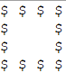

# 💠 Dollar Square Pattern in Java

This project demonstrates how to use **nested loops** and **conditional logic** in Java to create a hollow square pattern made of dollar symbols (`$`). It's a simple yet effective example of control structures and console-based pattern printing — often asked in coding interviews and programming fundamentals assessments.

---

## 🧩 Output Example

For `n = 4`, the output of the program is:

## Output

