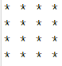

# 🔷 Asterisk Square Pattern in Java

This simple Java program prints a **filled square pattern** made entirely of asterisks (`*`). It’s a classic example of using **nested loops** — a key concept in beginner-level Java and competitive coding.

---

## 🧩 Output Example

For a square of size `4`, the output will be:

## Output

