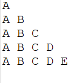

# 🔠 Triangular Alphabet Pattern in Java

This Java program prints a **right-angled triangular pattern of alphabets**, increasing in each row. It’s a fundamental exercise for understanding **looping structures** and **character handling** in Java, frequently seen in interview prep and beginner coding challenges.

---

## 🧩 Output Example

For `rows = 5`, the output of the program is:

## Output

